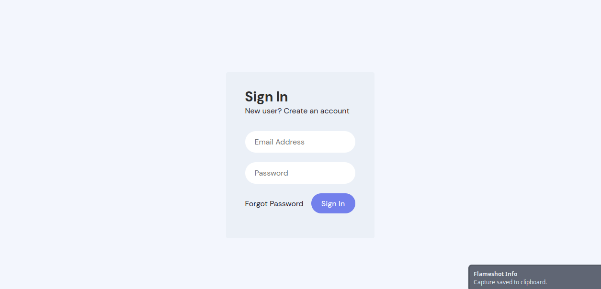
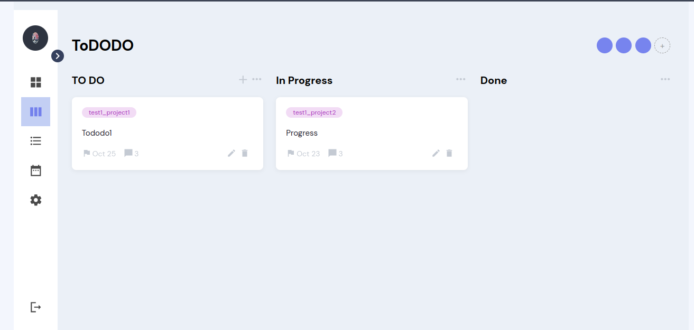

# L-2 ToDoDo
ToDoDo is a web technology project for CSIT 5th semester
## Table of Contents
- [Introduction](#about-tododo)
- [Features](#key-features)
- [Getting Started](#getting-started)


## About ToDoDo
ToDoDo is a dynamic task management platform designed to help and make team collaboration much more easier and boost productivity. This application provides an intuitive interface for creating, assigning and tracking tasks, making it an ideal tool for project management, agile development and team coordination.

## Key Features 
- User Authentication
- Task creation and project assignment
- Priority and Categorization
- Real-time Updates
- User-friendly interface

## Getting Started
To get started with this project, follow these steps:

### Prerequisites
Before you begin, make sure you have the following installed on your system:
- [Node.js](https://nodejs.org/)(for package management and running scripts)
- [Composer](https://getcomposer.org/)(for managing PHP dependencies)
- [Laravel](https://laravel.com/docs/10.x#your-first-laravel-project)(for setting up)

### Setting up the project
1. Clone the repo to your local machine:
```bash
git clone https://github.com/bajrasushant/L2-ToDoDo
```
2. Navigate to the project directory
```bash
cd L2-ToDoDo
```
3. Install PHP dependencies
```bash
composer install 
```
4. Set up your `.env` file seeing the`.env.example` with necessary configuration

5. Using Xampp for MySQL
	-	Download and install xampp
	- Start Apache and MySQL servers using XAMPP control panel.
	- Create a new database for the project by navigating to `https://localhost/phpmyadmin`
	- In your Laravel project's `.env` file update the database configuration
	```
	DB_CONNECTION=mysql
	DB_HOST=127.0.0.1
	DB_PORT=3306
	DB_DATABASE=your_db_name
	DB_USERNAME=root
	DB_PASSWORD=
	```

6. Generate new application key
```bash
php artisan key:generate
```

7. Run migrations
```bash
php artisan migrate
```

8. Start Laravel development server
```bash
php artisan serve
```

## Screenshots



